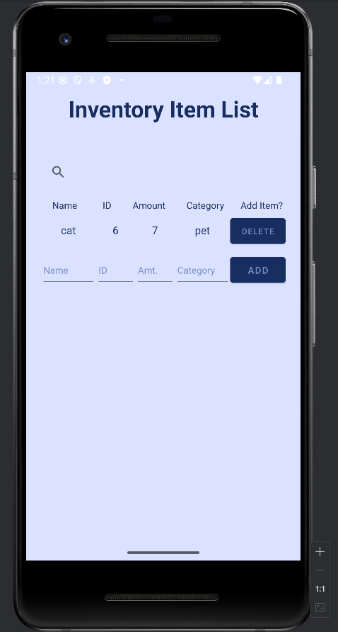
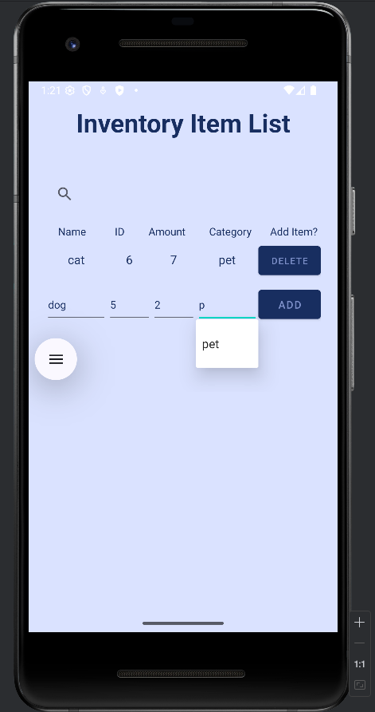
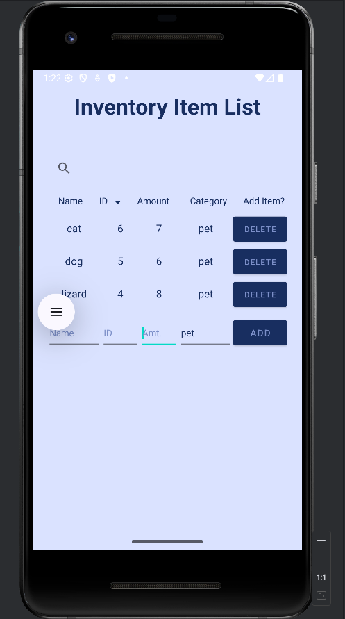
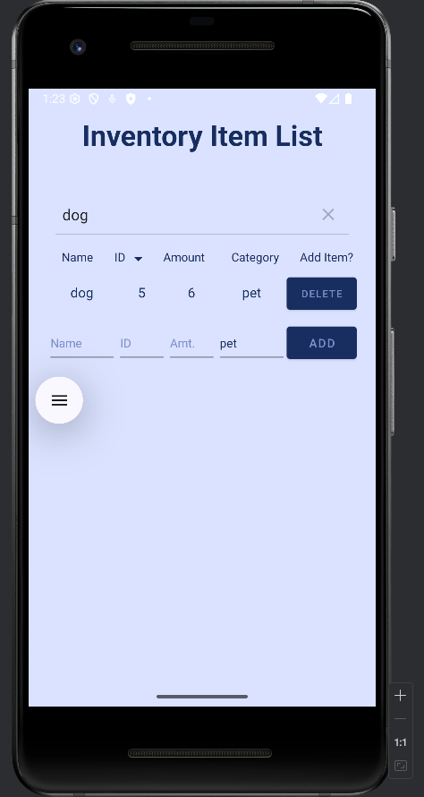
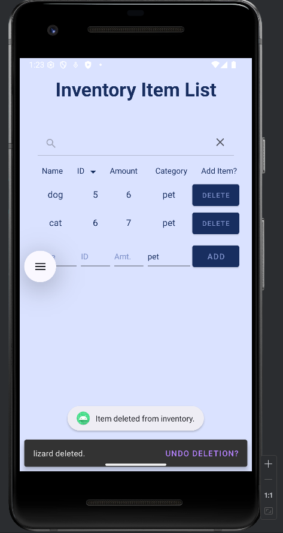
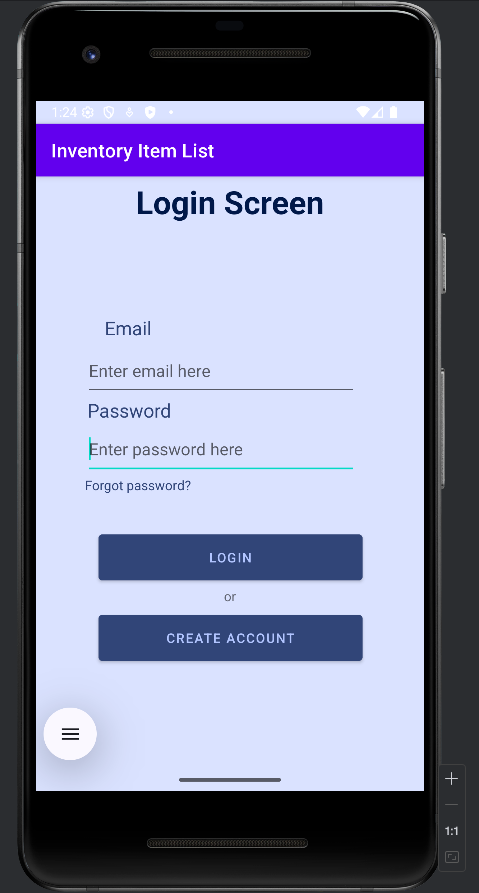
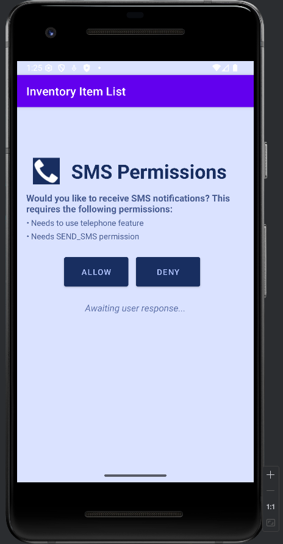
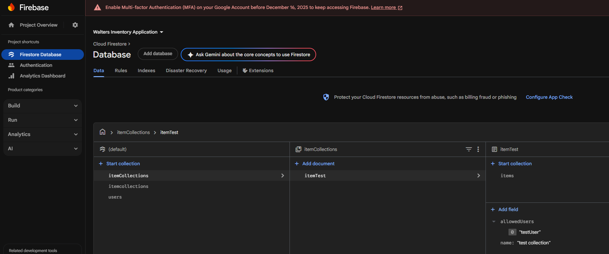
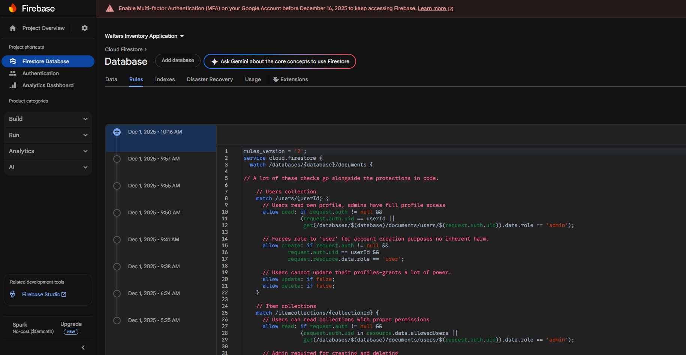
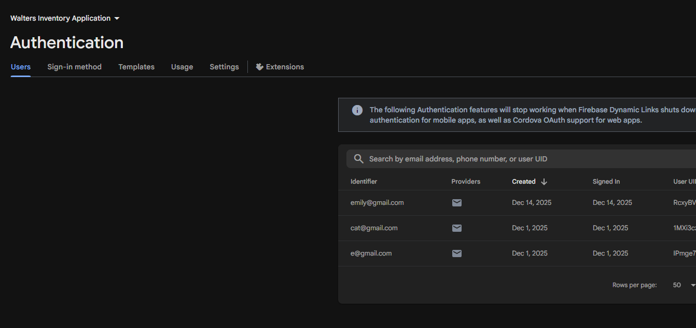

This website serves as my ePortfolio for the CS-499 Computer Science Capstone with Southern New Hampshire University. Throughout this ePortfolio, I will share a professional self-assessment, a code review demonstrating my improvements towards my original artifact, and my three major enhancements in Software Design and Engineering, Algorithms and Data Structure, and Databases.

My progression through the Computer Science program at Southern New Hampshire University and through the Capstone for this program shows that I have demonstrated proficiency in the following five outcomes: 

- Employ strategies for building collaborative environments that enable diverse audiences to support organizational decision making in the field of computer science
- Design, develop, and deliver professional-quality oral, written, and visual communications that are coherent, technically sound, and appropriately adapted to specific audiences and contexts
- Design and evaluate computing solutions that solve a given problem using algorithmic principles and computer science practices and standards appropriate to its solution, while managing the trade-offs involved in design choices
- Demonstrate an ability to use well-founded and innovative techniques, skills, and tools in computing practices for the purpose of implementing computer solutions that deliver value and accomplish industry-specific goals
- Develop a security mindset that anticipates adversarial exploits in software architecture and designs to expose potential vulnerabilities, mitigate design flaws, and ensure privacy and enhanced security of data and resources

Beginning with this professional self-assessment, I can give you a lens into what I have learned and the skills I have refined during my time as a student at Southern New Hampshire University. 

---

# Professional Self-Assessment

  The journey I have traversed at Southern New Hampshire University in the Computer Science program alongside my skill refinement within the program’s capstone has helped me transform from a learning student within the field into a career-ready professional through extensive applications and exposure to real-world problems, communication, and solution development. I have learned in detail about a variety of topics related to the discipline as well as expanded my knowledge through interdisciplinary studies, and through my coursework I have worked to hone my skills related to critical thinking, problem solving, adaptability, and understanding complex structures and systems. In tandem with my coursework, I have also refined communication skills with both technical and nontechnical audiences, teamwork with colleagues, and time management.
My experience with teamwork and collaboration in the world of computer science began in the same place that my passion for software development and computer science truly blossomed, this being my time from elementary school all the way to high school immersed in the world of FIRST robotics. After deciding to narrow down my decision on my career path to computer science, I was able to apply the skills I learned there directly to what I have learned with my time here at Southern New Hampshire University. On the technical side of the team, we had subdivisions that focused on building, designing, and programming the robot, all of which I spent time in, with a majority of that time being spent in the programming sector. With my particular focus on programming, I was able to learn about the use of multiple languages such as Java, LabVIEW, and Python in the application of robotics, and through the application of good practices, this knowledge followed me into my pursuance of my Computer Science degree. It would be an incomprehensive discussion of my progression through the program without acknowledging the background I came from that provided me with the passion and understanding I possessed related to the field before my time at SNHU.

  I started my journey at Southern New Hampshire University with most of my general education credits out of the way which resulted in a majority of my studies with this institution being focused on the study of my major. However, in my interspersed interdisciplinary studies as well as in my major-related coursework, I spent a significant amount of time learning how to hone my communication skills in front of both technical and nontechnical audiences. Within courses that focused on the software development lifecycle and operating architectures like CS-250: Software Development Lifecycle and CS-230: Operating Platforms, I produced coursework and communicated with peers in both technical writing through detailed descriptions of system architecture and requirements and nontechnical writing that illustrated purpose, intent, capabilities, and limitations of systems and software to audiences who are less acquainted with the technical aspects of these structures. In my more advanced programming courses like CS-210: Programming Languages and CS-360: Mobile Architecture & Programming, there was an additional need to both assess and document requirements of complex applications and the systems they possessed, develop adequate software to meet these requirements, and produce this software alongside language explaining technical function and nontechnical application usage to end users. These projects also recognized the need to produce systems that were accessible to users and adequately communicated functionality to stakeholders without technical understanding. Without exception, the courses I took at SNHU in every subject facilitated an environment that required a deep technical understanding of the projects I worked on and a need to be able to translate this understanding to all audiences. 

  Another skill that I demonstrated in every course I took at SNHU without exception is the skill of collaborating in a team environment. Beyond the relation of this skill to communicating with stakeholders alongside other audiences, I collaborated with my peers to both provide and receive feedback on projects through peer review workshops such as the collaboration that occurred in IDS-410: Problem Solving Social Change. This course focused largely on a cumulative breakdown of a social issue and how to develop a plan to implement realistic and tangible change, and this required critical breakdowns from peers on these topics to address faults and improve each other’s work to enhance the outcome. Albeit a totally unrelated course, another course that illustrated related peer review was CS-330: Computational Graphics and Visualization, where we were able to review each other’s project submissions and provide constructive feedback on whether these projects met the necessary criteria for submission.

  Another angle of my refinement of my collaboration skills can be illustrated through the broadening of my awareness of diverse individuals and varying perspectives while at SNHU. Part of what began my personal emphasis of the value of these skills was also through robotics, especially on a world-competing FRC (First Robotics Competition) team during high school. I spent a significant amount of time with community outreach and the need to make technology accessible which was demonstrated not with our (equally qualifying) robot but with our standing for competing on the world level for the Chairman’s Award/Impact Award which represents embodying FIRST principles and transforming culture and inspiring youth to value STEM. This also resulted in interactions with students all over the world with different backgrounds through these competitions who were all connected through the passion for technology. These values were further refined at SNHU as I frequently discussed varying perspectives during peer discussion. Through courses like IDS-105: Cultural Awareness and Online Learning and PHL-260: Ethical Decision-Making and Problem Solving, I frequently collaborated with my peers through listening to and engaging with their perspectives on various social issues as well as their life experiences prior to and during their studies at SNHU. Southern New Hampshire prides itself on its diversity of students, and every interaction I had with my peers here enlightened me further on how our experiences and walks of life can vary greatly while we simultaneously all pursue the same goal of furthering our education for new experiences. These courses and experiences also enhanced my understanding of applying ethics in professional settings, and this is especially applicable when producing software that is structured and used ethically. This is especially relevant beyond my interest in software development and into my other focus on software security, as the weight of ensuring information is held and accessed ethically entered the forefront of my mind when discovering how biases can have a significant effect on particular groups.

  Beyond these broader skills that help shape professional development through the study of computer science, there is also a fundamental need to possess understanding of both the breadth and depth of technical knowledge that there is to explore in the field. My skills in data structure and algorithms, software engineering and design, databases, and security will be presented in the artifacts and the enhancements I made to them for this capstone project, but I have demonstrated similar skills throughout all of my studies at Southern New Hampshire University. I demonstrated skills of software engineering extensively (possibly the most extensively of these notable technical skills) throughout my studies through both conceptual classes related to software architecture and operational coursework related to developing complex software. Through courses like IT-140: Introduction to Scripting, IT-145: Foundation in Application Development, and CS-210: Programming Languages, I developed numerous projects in Python, Java, and C++ that demonstrated the systemic function and understanding of software containing modular architecture. These skills also involved learning object-oriented programming principles in order to develop clean structure and adaptable software. I also have demonstrated skills in data structure and algorithms (DSA) through specific courses that focused on better understanding of these structures and the algorithms that process this data like CS-255: System Analysis and Design; in this course, I learned about creating system models to better understand structures of systems. Within the same term, I also took CS-300: DSA: Analysis and Design, which is a better specific breakdown of this category where I learned particularly how to establish different data structures like vectors, hash tables, linked lists, and binary search trees, and different algorithms to help understand how to sort and search through this data. I also have understanding about the fundamentals of Big-O notation to determine how algorithms will be most efficient. My coursework also demonstrated fundamental understanding of these structures and algorithms through pseudocode and flowcharts. I have also exhibited the skill of an understanding of databases through my implementation of these other skills into the use of data storage techniques within database management systems. I applied the use of both relational and non-relational databases through MySQL and MongoDB in courses DAD-220: Introduction to Structured Database Environments and CS-340: Client/Server Development as well as the comparison of the benefits and drawbacks of using each type of system. I was able to demonstrate the development of CRUD functionality and developing advanced queries to demonstrate meaningful search results and provide insight into what these results express in a nontechnical format.

  I have demonstrated the skill of development with relation to security during my time at Southern New Hampshire university through doing extensive research on how to thoroughly implement security concepts throughout the entire software development lifecycle. When taking the course CS-305: Software Security, I demonstrated skills related to generating certificates, deploying ciphers, demonstrating various methods of testing, and ensuring secure communications. I also did extensive research on how to determine whether software is secure through dependency checks where I determined how severe various vulnerabilities were and analyzing what exploits were commonly found through these dependency versions based on OWASP CVEs (Open Worldwide Application Security Project, Common Vulnerabilities and Exploits). I learned about how the CIA triad applies to ensuring data can be conceptually understood as being secure through proper confidentiality, integrity, and availability. Another course I took, CS-320: Software Test, Automation, and Quality Assurance, allowed for me to develop skills related to static and dynamic software testing to ensure that software is being published that has been extensively monitored for bugs and errors that present risks or poor software quality. Overall, I have studied security from various fronts, whether it be employing safe measures throughout development, thorough software testing, and understanding the value of security and how it can be implemented throughout a project with proper DevSecOps practices. I have shown particular interest in cybersecurity and took certain courses as electives like CYB-200: Cybersecurity Foundations to better grasp how security can be implemented and what it looks like to implement these valuable checks, and my grasp of ethical data access and software development goes hand in hand with proper security measures.

  My professional assessment will provide me with the skills to advocate for myself and what I am capable of through both the work I have done to showcase my technical skills as well as my soft skills demonstrated through my communication of my critical thinking and problem solving related to issues that exist within my own work, my ability to devise a plan and analyze software and its systems to improve upon it at its core while providing future room for adaptability, and my ability to reflect and constantly strive for improvement in all of my work. I am proud to be able to reflect on the passion and resilience I have poured into all of my coursework at Southern New Hampshire University and how that is reflected throughout my capstone project that illustrates a final summation of the work I have done as well as how I will continue to improve and create new meaningful work in the future.

---

# Informal Code Review

For this ePortfolio, I have chosen to demonstrate the three major enhancements using an inventory application from CS-360: Mobile Architecture and Programming. The original application features a login portal, a main activity displaying an inventory stored in a SQLite database, and SMS permissions that notify when an item has reached low stock. The following code review covers existing application functionality, an analysis for improvement of the code, and areas of enhancement in Software Design and Engineering, Algorithms and Data Structure, and Databases.

<iframe width="560" height="315" src="https://www.youtube.com/embed/hlcshzuKRJs?si=p5SqfbURtTG-h4T3" title="YouTube video player" frameborder="0" allow="accelerometer; autoplay; clipboard-write; encrypted-media; gyroscope; picture-in-picture; web-share" referrerpolicy="strict-origin-when-cross-origin" allowfullscreen></iframe>

---

# Artifact Selection

I have chosen to substantially enhance a particular artifact from CS-360: Mobile Architecture and Programming where I developed an inventory application in a few significant avenues. I worked on this application from August to September of 2025 with its eventual submission for my final project for the course. I saw this project as the perfect blueprint for this capstone project; while it served as a testament to my learning at SNHU as a complex project I developed entirely from scratch featuring both back-end and front-end development, it also had significant room for improvement and enhancement in various avenues. Through my development of this project, I had to apply previous programming and system design skills to develop an application that could meet user needs and properly convey its abilities to the user. I also used skills related to databases as related to its simple application of SQLite, and it demonstrated basic CRUD functionality alongside promising room for improvement with DSA implementation. Because of the nature of this application, it provided me with an opportunity to give it a significant structural rehaul alongside the introduction of role-based access control which demanded much clearer and detailed methods related to limitations of features and functionality dependent on the user, and corresponding UI/UX changes. Further substantial structural changes occurred with the DSA improvements that illustrated proper search and sort functionality, and with this an improvement to the user interface related to these changes, new database values, proper POJO classes for helping translate database information between the user and the database, and a rehaul of CRUD functionality. The enhancements also illustrate a total rehaul with the implementation of Firebase rather than SQLite, which demonstrated significant change through user authentication, Firestore data storage, and an additional permission check on database item security through Firebase permissions (which also resulted in multi-user database access and secure login systems). These significant changes have demonstrated that I developed a complex and fully functional application for a project, but that I was able to point out the areas of improvement and provide entirely new iterations relevant to expressing the refinement of the various skills I have acquired with Southern New Hampshire University.

---

# Software Design and Engineering
## Access Enhanced Artifact [Here](Artifacts/Software Design and Engineering Enhancement/WaltersCS360InventoryApp)

For software design and engineering, I have implemented role-based access control into the application. This involved an extensive overhaul of preexisting software structure as well as new corresponding UI components or visual updates according to the user's role. Future iterations of the application include further failsafes related to the roles that have been added. 

As my initial plan for this artifact stated: 

> It will extend beyond simply defining a new role in the database; the application will need this, but it will primarily introduce implementation of user authentication, and it will also need additional logic that is capable of handling how the application responds and provides different elements for the user to interact with depending on their role. This also involves determining what features and functionality are available to different roles (i.e. an administrative role being the only one that can add items rather than just adjust quantities). There will need to be structural changes to the application that help distinguish direct database interaction from the activity logic, so a class to handle user information should be developed as well as a class to handle determining the user’s role. Then, an additional helper class can manage user authentication upon login, and appropriate logic can be enforced to direct a user to the appropriate screen.

While there was significant structural change between the original project and this enhancement version, for these snippets I will highlight the specific changes that shine through with the RBAC implementation.

This snippet demonstrates the RoleHelper class which determines which users are allowed to perform certain actions within a RoleHelper class.

```
public class RoleHelper {
    public static boolean canAddItems(String role) {
        return role.equals("admin");
    }

    public static boolean canEditItems(String role) {
        return role.equals("admin") || role.equals("user");
    }

    public static boolean canDeleteItems(String role){
        return role.equals("admin");
    }

    public static boolean canViewItems(String role){
        return role.equals("admin") || role.equals("user") || role.equals("viewer"); // There is no limitation for viewing items
    }
}
```

These roles are stored within the creation of the user database.

```
public void onCreate(SQLiteDatabase db) {
        db.execSQL("CREATE TABLE users (user_id INTEGER PRIMARY KEY AUTOINCREMENT, username TEXT, password TEXT, role TEXT)");
        db.execSQL("CREATE TABLE inventory (item_id TEXT, name TEXT, amount INTEGER, user_id INTEGER, FOREIGN KEY(user_id) REFERENCES users(user_id))");
        int DATABASE_VERSION = 2;
    }

    // Creation of a new user in the database.
    public int createUser(String username, String password, String role) {
        SQLiteDatabase db = getWritableDatabase(); // needs to be editable
        ContentValues values = new ContentValues();
        values.put("username", username);
        values.put("password", password);
        values.put("role", role);

        return (int) db.insert("users", null, values);
    }
```

Then, the role of the user can determine what UI elements are visible so that actions that are impossible for a certain user will not present as being possible.

```
if (!RoleHelper.canAddItems(currentUserRole)) {
            btnAddItem.setVisibility(View.GONE); // using View for simplicity
        }
```

We also can see how these roles are implemented within additional checks beyond hidden UI elements; this means that if, for whatever reason, the user is still able to see certain elements that they shouldn't or have access to these methods, there are additional checks in place to verify the user is able to perform a certain action before it occurs. This is visible in this example with the method to add items to the database based on the user's input amongst all of the other input validations with the first if statement where the RoleHelper check occurs:

```
private void addItem() {
        // Even though the button should be hidden, this is an additional RBAC check
        // to make sure the user cannot access the item. Notifies user and ends action.
        if (!RoleHelper.canAddItems(currentUserRole)) {
            Toast.makeText(this, R.string.invalid_perms,Toast.LENGTH_SHORT).show();
            return;
        }

        String name = itemNameAdd.getText().toString().trim();
        String id = itemIdAdd.getText().toString().trim();
        String amtEntry = itemAmtAdd.getText().toString().trim();
        int amount;

        // Making sure there is valid data to enter in all fields
        if (name.isEmpty() || id.isEmpty() || amtEntry.isEmpty()) {
            Toast.makeText(this, R.string.fill_fields, Toast.LENGTH_SHORT).show();
            return;
        }

        // Need a try catch so that we can prevent invalid entry ahead of time
        try {
            amount = Integer.parseInt(amtEntry);
            if (amount < 0) throw new NumberFormatException();
        } catch (NumberFormatException exception) {
            Toast.makeText(this, R.string.invalid_amount, Toast.LENGTH_SHORT).show();
            return;
        }

        if (db.addItem(id, name, amount, currentUserId)) {
            clearEntries();
            loadItems();
            checkStock();
            Toast.makeText(this, R.string.item_added, Toast.LENGTH_SHORT).show();
        } else {
            Toast.makeText(this, R.string.id_exists, Toast.LENGTH_SHORT).show();
        }

        loadItems();

    }
```

Overall, the Software Design and Engineering enhancement saw changes in role-based access control which resulted in a need for significant structural changes of the original application to store user data in a way that is more efficient and creates a better opportunity for users to have proper access to certain aspects of inventory management which helps to keep items secure. The resulting UI changes keep the app more streamlined depending on user needs and are relevant to what the user is capable of performing. Toasts are used throughout these changes to help communicate with the user what the application is performing.

The enhancement's narrative includes a further breakdown of the troubleshooting process and meeting outcomes related to this category.
### You can read the full narrative of the Software Design and Engineering artifact enhancement [here](/Narratives/Software Design and Engineering Narrative.pdf).

---

# Algorithms and Data Structure
## Access Enhanced Artifact [Here](Artifacts/Algorithms and Data Structure Enhancement/WaltersCS360InventoryApp)

For the category of algorithms and data structure, this artifact was perfectly suited to demonstrate an enhancement related to efficiency of using the inventory. As it stood, the inventory functioned well in terms of storing item data, but there was no good way to sort and filter items which would become extremely inconvenient and could even render the application unusable if not implemented. 

As outlined with my initial intentions of improvement in this category:

> I will first have to improve the information that is stored based on items by providing more information (not all of which may necessarily be visible at all times; for example, a primary addition will be item categories). I will then have to format the items within the database in a way that they can be properly indexed, which in this case an array will serve well for due to the similarities of the data between entries. I will then need to create algorithmic logic that is capable of searching between the various types of information associated with an item (searching by name, category, or quantity). There will need to be additional user interface elements that the user can interact with to search for items, and logic that accounts for the user interface updating to show these results. Overall, I would like for this enhancement to be able to provide the user with the tools to search for items based on a variety of factors and be provided with an efficient return of results.

This initial layout of how this enhancement was implemented is applicable to the steps I followed and the highlights of the new implementation within the code. Similarly to how in the Software Design and Engineering artifact I introduced a class for Users, there is also an implementation of the Item POJO class in this enhancement. From here, rather than loading a newly created ArrayList for the old method, we retrieve items using the Item object which exists in our DatabaseHelper:

```
public ArrayList<Item> getItemObjects (int userId) {
        SQLiteDatabase db = getReadableDatabase();
        ArrayList<Item> items = new ArrayList<>();

        Cursor cursor = db.rawQuery("SELECT item_id, name, amount, category FROM inventory WHERE user_id=?",
                new String[]{String.valueOf(userId)}
        );

        while (cursor.moveToNext()) {
            items.add(new Item(
                    cursor.getString(0),
                    cursor.getString(1),
                    cursor.getInt(2),
                    cursor.getString(3)
            ));
        }

        cursor.close();
        return items;
    }
```

This leads directly into our new methods to load items, load filtered items, and to filter items themselves depending on the new structure. This serves as our search functionality with the ability to load the new set of items based upon filtering by the query:

```
// Item filtering from search bar query
    private void filterItems(String query) {
        // null checks
        if (allItems == null ) {
            allItems = new ArrayList<>();
        }
        if (filteredItems == null) {
            filteredItems = new ArrayList<>();
        }
        filteredItems.clear();

        if (query == null) query = "";

        for (Item item : allItems) {
            if (item == null) continue;
            String name = item.getName();
            if (name != null && name.toLowerCase().contains(query.toLowerCase())) {
                filteredItems.add(item);
            }
        }

        loadFilteredItems();
    }

    private void loadFilteredItems() {
        if (filteredItems == null) filteredItems = new ArrayList<>();
        if (itemsList == null) return;
        itemsList.removeAllViews();

        for (Item item : filteredItems) {
            if (item != null) {
                addItemRow(item.getItemId(), item.getName(), item.getAmount(), item.getCategory());
            }
        }
    }

    private void loadItems() {
        itemsList.removeAllViews(); // removes views for cleanup/refresh of items
        // ArrayList<String[]> items= db.getItems(currentUserId);
        allItems = db.getItemObjects(currentUserId); // Items before search
        if (allItems == null) allItems = new ArrayList<>();
        filteredItems = new ArrayList<>(allItems); // Items filtered from search

        // Updated to use Item ArrayList with all items rather than the String ArrayList
        for (Item item : allItems) { // iterator for loading in each item
            addItemRow(item.getItemId(), item.getName(), item.getAmount(), item.getCategory());
        }

        loadFilteredItems();
    }
```

Another highlight of this enhancement is the sort functionality, and since we have multiple sorting parameters per value that cannot exist simultaneously, a switch case was used to compare a certain value for sorting. This also shows how there is a new category value, and the updateArrows method refers to UI changes based upon ascending and descending search which it toggles through. The method for updating categories allows for suggestions for a category when adding a new item based upon old items' categories which is implemented throughout item changes in the activity to account for changes as are the filters and other live changes:

```
private void sortByValue(String value) {
        if (filteredItems == null || filteredItems.isEmpty()) return;

        // If reclicking same sorted column, swaps from ascending to descending
        if (lastSortedValue.equals(value)) {
            ascending = !ascending; // flipping boolean
        } else {
            ascending = true; // correcting in case other sorts
        }
        lastSortedValue = value;

        Comparator<Item> comparator;

        switch (value) {
            case "id":
                comparator = Comparator.comparing(Item::getItemId, String.CASE_INSENSITIVE_ORDER);
                break;
            case "amount":
                comparator = Comparator.comparing(Item::getAmount);
                break;
            case "category":
                comparator = Comparator.comparing(Item::getCategory, String.CASE_INSENSITIVE_ORDER);
                break;
            default: // name by default
                comparator = Comparator.comparing(Item::getName, String.CASE_INSENSITIVE_ORDER);
                break;
        }
        if (!ascending) {
            comparator = comparator.reversed();
        }

        filteredItems.sort(comparator);
        loadFilteredItems();
        updateArrows(value, ascending);
    }

    // Updates the visual cues that show whether it is ascending or descending.
    private void updateArrows(String lastSortedValue, boolean ascending) {
        TextView[] headers = {itemNameHdr, itemIdHdr, itemAmtHdr, itemCatHdr};
        String[] values = {"name", "id", "amount", "category"};

        for (int i = 0; i < headers.length; i++) {
            if (values[i].equals(lastSortedValue)) {
                headers[i].setCompoundDrawablesWithIntrinsicBounds(
                        null, null, ascending ? arrowUp : arrowDown, null
                );
            } else {
                headers[i].setCompoundDrawablesWithIntrinsicBounds(null, null, null, null);
            }
        }
    }

    private void updateCategories(String newCategory) {
        if (newCategory == null || newCategory.isEmpty()) return;

        // Seeing if category already exists
        boolean exists = false;
        for (int i = 0; i < catAdapter.getCount(); i++) {
            if (catAdapter.getItem(i).equalsIgnoreCase(newCategory)) {
                exists = true;
                break;
            }
        }

        // Add category if not in adapter
        if (!exists) {
            catAdapter.add(newCategory);
            catAdapter.notifyDataSetChanged();
        }
    }
```

The DSA enhancements also allowed for revisions of functionality of editing items and other minor functionality updates, and the CRUD functionality is newly responsive to the preferred method of item storage. These overhauls all throughout the application allow for a much more smooth and useful user experience through linear search for item filtering, data structure improvement, UI-related changes to accommodate for searching and sorting, CRUD changes related to item storage, and better-suited minor UI updates to clarify what points of interaction result in what actions taking place (quantity edit requires clicking on quantity itself, not whole row, and category editing also added). These changes add new and much-needed functionality to the application with visual updates to provide the user with these actions.

The enhancement's narrative includes a further breakdown of the troubleshooting process and meeting outcomes related to this category.

### You can read the full narrative of the Algorithms and Data Structure artifact enhancement [here](Narratives/Algorithms and Data Structure Narrative.pdf).

---

# Databases
## Access Enhanced Artifact [Here](Artifacts/Databases Enhancement/WaltersInventoryApp)

For this enhancement, the application faced its greatest overhaul through its migration to the use of Firebase. These changes allowed for user authentication, email-based login and a lack of storing sensitive information locally, cloud storage, and multi-user access that pairs with rule-based access for item data as another permission failsafe. 

As noted within my original plans for the database enhancement,

> This transition will involve the introduction of Firebase into the application through the necessary dependencies. Then, I will have to map data so that it can be transferred comparatively from a table in SQLite to how this data will be formatted in Firebase (for both users and items). Then, instead of using queries directly within the preexisting classes like before, there will be a new class implemented that serves as the junction between SQLite and Firebase as a repository that provides data to the Activity regardless of its source, and then UI updates will need to be considered alongside proper syncing based on changes. This is then where we can implement decisions being made only based on whether the user has permissions to make certain changes on levels beyond just what is visible to the user or checked by CRUD operations and ties directly to the data. (https://firebase.google.com/docs/database/android/start)

At this point forward, there is a lot of reduction of previously used code, but the changes that were made before it still prove to be entirely necessary because the improvement to the initial structure of the app allowed for a much more seamless and logical conversion between its preexisting state into an application fully supported by new backend services that completely change the application's baseline functionality into something much more, and even open the door into much greater improvements with all of the services that Firebase has to offer.

Within the code, we see a complete removal of the previous DatabaseHelper class, and this becomes the FirebaseHelper class. This means that the structures of data that previously existed had to be converted into the more abstract classifications that Firestore uses. In order to allow for multi-user access, we had beyond just "items" and "users" collections. Instead, we used "ItemCollection" (also resulting in a new POJO class) to show how the items are stored within it, but there are given allowed users that can access the database which ties to the other "users" collection referring back to user logins for proper collection access. This then results in an instance of the database being created with the FirestoreHelper. We can then look at one of the methods and its associated listener that shows improvement and demonstrates a variety of features:

```
    // ItemCollection methods (as in the collection of items that includes who has permissions)
    // Retrieves item collections based on user's UID and stores it in ItemCollection (as in a
    // single inventory) object. ItemCollection represents an inventory that contains Items.
    public void getItemCollections(String uid, OnItemCollectionsLoadedListener listener) {
        db.collection("itemcollections")
                .whereArrayContains("allowedUsers", uid)
                .get()
                .addOnSuccessListener(querySnapshot -> {
                    List<ItemCollection> collections = new ArrayList<>();
                    for (DocumentSnapshot doc : querySnapshot.getDocuments()) {
                        String collectionId = doc.getId();
                        String name = doc.getString("name");
                        collections.add(new ItemCollection(collectionId, name));
                    }
                    listener.onLoaded(collections);
                })
                .addOnFailureListener(listener::onError);
    }

    // Listener for a loaded item collection
    public interface OnItemCollectionsLoadedListener {
        void onLoaded(List<ItemCollection> collections);
        void onError(Exception e);
    }
```

There are several points of acknowledgment within the above snippet. We see the usage of a loaded listener-Firestore makes use of asynchronous calls. We can also see the reference to the "allowedUsers" to verify connections to a collection of items dependent on the user's ID. Ultimately, though, we can see the total replacement of previous methods where calls to SQLite through queries are totally removed and instead we have calls between Firestore and the application.

Another substantial change can be particularly observed in how logins are handled. Instead of calling for information from the user database like before, authentication and user login are handled entirely with Firebase. We can take a look at how logins are handled using an instance of FirebaseAuth in conjunction with the user data stored in Firestore:

```
// Logic for handling user login upon button press
    private void handleLogin() {
        String email = usernameEntry.getText().toString().trim();
        String password = passwordEntry.getText().toString().trim();

        if (email.isEmpty() || password.isEmpty()) {
            Toast.makeText(this, R.string.fill_fields, Toast.LENGTH_SHORT).show();
            return;
        }

        // Uses email and password sign-in method
        mAuth.signInWithEmailAndPassword(email, password)
                .addOnSuccessListener(authResult -> {
                    FirebaseUser user = mAuth.getCurrentUser();
                    if (user == null) {
                        Toast.makeText(this, R.string.login_unsuccessful, Toast.LENGTH_SHORT).show();
                        return;
                    }

                    // Fetch user role
                    db.collection("users")
                            .document(user.getUid())
                            .get()
                            .addOnSuccessListener((DocumentSnapshot doc) -> {
                                if (doc.exists()) {
                                    String role = doc.getString("role");

                                    // Save user login preferences
                                    prefs.edit()
                                            .putBoolean("logged_in", true)
                                            .putString("user_role", role)
                                            .apply();

                                    Toast.makeText(this, R.string.login_successful, Toast.LENGTH_SHORT).show();
                                    goToMain(user.getUid(), role);
                                } else {
                                    Toast.makeText(this, R.string.missing_profile, Toast.LENGTH_SHORT).show();
                                }
                            });
                })
                .addOnFailureListener(e ->
                        Toast.makeText(this, "Login failed: " + e.getMessage(), Toast.LENGTH_SHORT).show()
                );

    }
```

Now, we can look at how this affects our primary activity through one of the simpler methods like items being loaded where it calls upon the FirestoreHelper and uses the listener to prepare these items for the user:

```
    // Load items that exist within the collection (also used for refreshing)
    private void loadItems() {
        if (currentCollectionId == null) return;

        firestoreHelper.getItems(currentCollectionId, new FirestoreHelper.OnItemsLoadedListener() {
            @Override
            public void onLoaded(List<Item> items) {
                allItems = new ArrayList<>(items);
                filteredItems = new ArrayList<>(allItems);
                loadFilteredItems();
                loadCategories();
            }

            @Override
            public void onError(Exception e) {
                Toast.makeText(MainActivity.this, "Failed to load items: " + e.getMessage(), Toast.LENGTH_SHORT).show();
            }
        });
    }

```

For this enhancement, it becomes clear that the changes occurring throughout each category are not merely improvements one after another-instead, they are better suited to exist as different enhanced versions of the application upon different needs. The Software Design and Engineering improvements present themselves as significant improvements to the structural integrity of the application, and the DSA changes allow for greatly enhanced functionality of the app that extends beyond the Software Design and Engineering changes. Beyond this point, the Database enhancement is a step even further beyond the DSA changes because it migrates the app entirely away from SQLite and makes use of the tool Firebase. For a less dependent version of the application, one could refer to the application's enhancements in the other two categories, but this Firebase rehaul takes the app to another level using external tools that allow for it to continue to be easily expanded upon and allowing for better abstraction of code. 

Another point of improvement in this enhancement involves significant enhancements in code documentation including a complete rehaul of all existing code comments as well as proper doc headers. All of these cumulative changes, including the extensive ones featured in this enhancement, alongside the refreshed comments take the application from a static offline inventory app to a cloud-based, secure, efficient, and far more scalable version of its previous iterations.

The enhancement's narrative includes a further breakdown of the troubleshooting process and meeting outcomes related to this category.

### You can read the full narrative of the Databases artifact enhancement [here](Narratives/Databases Enhancement.pdf).

---

# Application Demonstration

This section provides some example images of what the application user interacts with when it is emulated on a Pixel 2.

### Main inventory screen


### Main inventory screen with category suggestions


### Main inventory screen with sorted items


### Main inventory screen with filtered items


### Main inventory screen with undo snackbar


### Login screen


### SMS permission screen


# Firebase Demonstration

This section provides some example images of what the Firebase interface looks like for managing the application.

### Firestore collections


### Firestore rules


### Firestore authentication


---

# Outcome Reflection

Through the completion of this capstone project, its ePortfolio, and my time within this course and at Southern New Hampshire University, I have gained confidence in my abilities to become a successful professional and computer scientist. My accomplishments throughout my studies at this institution exemplify that I am prepared to demonstrate technical skills related to my profession and that I am capable of working with industry colleagues and leaders as well as stakeholders and potential business partners to create a product that excels beyond its requirements and exemplifies what it means to be a proficient and experienced software engineer. This specific ePortfolio demonstrates that I have met the following outcomes:
- Employ strategies for building collaborative environments that enable diverse audiences to support organizational decision making in the field of computer science
*I have developed a plan to implement both design and logic changes that require foundational changes to a preexisting system which requires checkpoints of decision-making related to every aspect of the application. I have expanded the application to accommodate for real-world multi-user usage, cloud-based data management, and user authentication with appropriate access to settings for administrative roles. The application has been developed to accommodate for different users in a hierarchal structure that keeps it minimal and digestible for simple interactions while still navigable for users with access to complex functionality.*
- Design, develop, and deliver professional-quality oral, written, and visual communications that are coherent, technically sound, and appropriately adapted to specific audiences and contexts
*I have introduced and implemented developments to my application that involve changes that are directly visible to technical and nontechnical users through role-based access control which will involve development of clear and logically flowing user interface specific to each user that meets industry standards. I have also implemented communication and feedback with the user to ensure the user can easily understand how to interface with the application. I have provided illustrations, an oral and visual code review, and narratives that successfully convey the purpose of the application to users. I have made choices with the user interface that help demonstrate clearly how the app is intended to function.*
- Design and evaluate computing solutions that solve a given problem using algorithmic principles and computer science practices and standards appropriate to its solution, while managing the trade-offs involved in design choices
*I have implemented enhancements that utilize algorithms to search for specific items that a user inquires about efficiently with corresponding balance through an appropriately placed and design-relevant search interface. I have implemented a data structure suited to properly manipulating and parsing user data in a way that returns it to be presented to the user meaningfully. I have carefully selected the most applicable data structure and corresponding method of search and sort for user items, and have implemented these usages to best benefit the user by making the app functional in a relevant way.*
- Demonstrate an ability to use well-founded and innovative techniques, skills, and tools in computing practices for the purpose of implementing computer solutions that deliver value and accomplish industry-specific goals
*I have demonstrated the usage of external tools to provide value to the project with the use of Firebase. This tool has enhanced and elevated the application to be realistic for industry standards and appropriate for proper usage with cloud data hosting. I have demonstrated the usage of innovative techniques and skills through combining modern and relevant tools with industry-standard practices in organization, syntax, code documentation, and object-oriented programming principles throughout every iteration of enhancement. I have properly and carefully restructured the application to accommodate for necessary changes while expanding it to become adaptable for future improvement. The application's broad and relevant usage allows for it to provide value to its users through inventory management that contains secure cloud-based storage, searching and sorting, role-based access control, and clear and intuitive user interface on a variety of accessible platforms through careful Android API selection.*
- Develop a security mindset that anticipates adversarial exploits in software architecture and designs to expose potential vulnerabilities, mitigate design flaws, and ensure privacy and enhanced security of data and resources
*I have developed a security mindset through the improvement of this application by restructuring code and doing static reviews to minimize overall structural risks and design flaws. I have deterred the risks of vulnerabilities through multiple failsafes with defense in depth through application-level RBAC as well as rules set within Firestore access. The application will fail securely and assume least privilege through default user access being minimal. User mediation occurs with constant checks to affirm access is allowed while balancing with ease of access of permission storage. The reduction of unnecessary dependencies and APIs helps reduce and minimize the potential attack surface of the application. Thorough testing and removal of queries with improper sanitization help keep the application safe from injection and other vulnerabilities. I have ensured the application does not store sensitive user data and it is handled by Firebase which ensures sensitive information is encrypted and separately accessed. I have verified on numerous fronts that users will be comfortable using the application through its various protective measures and thorough testing.*

